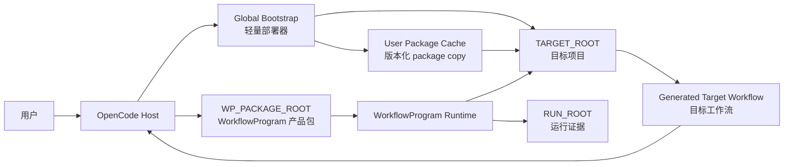
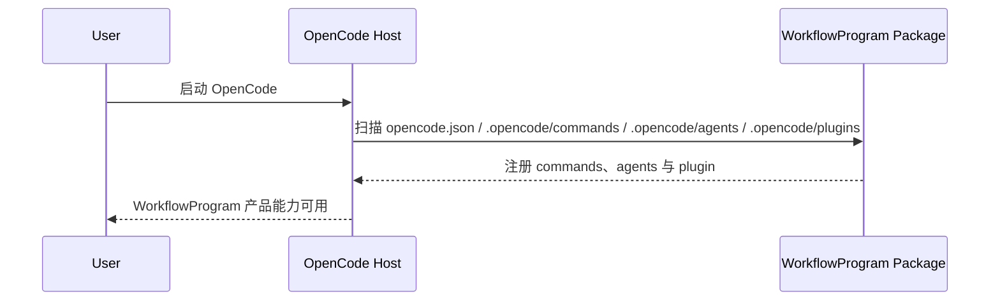
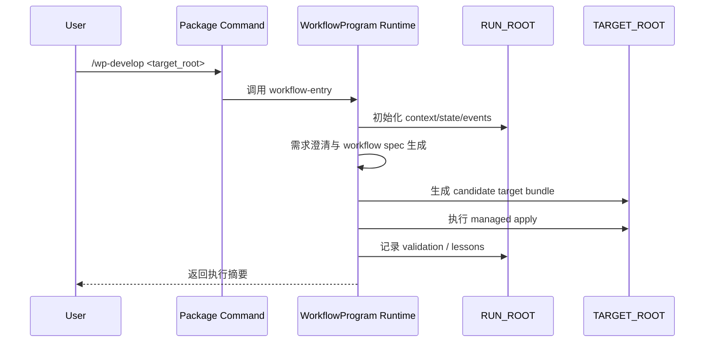
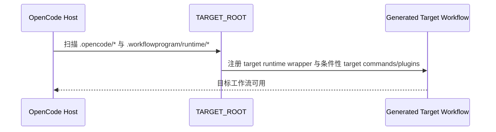
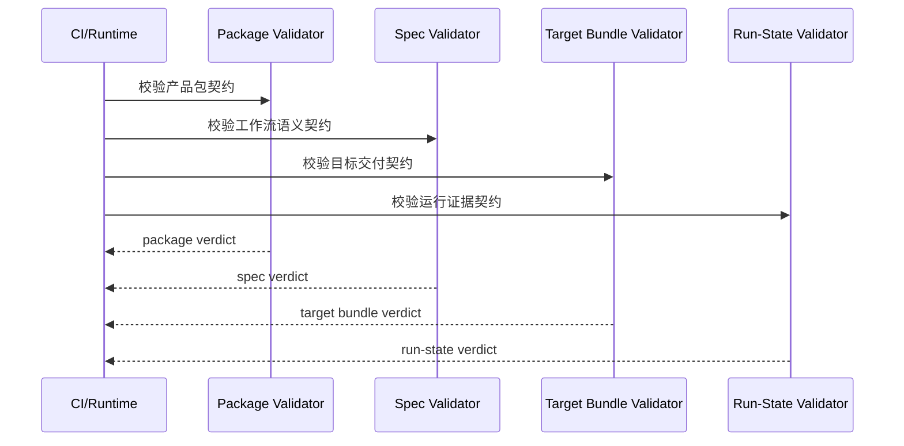
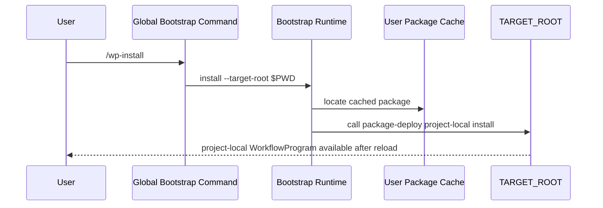
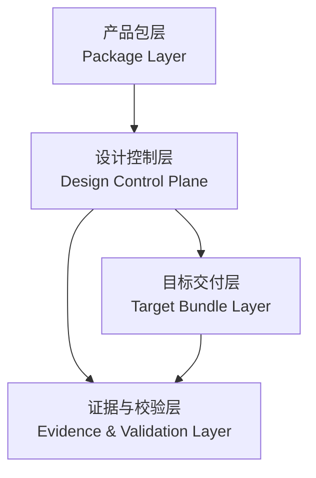
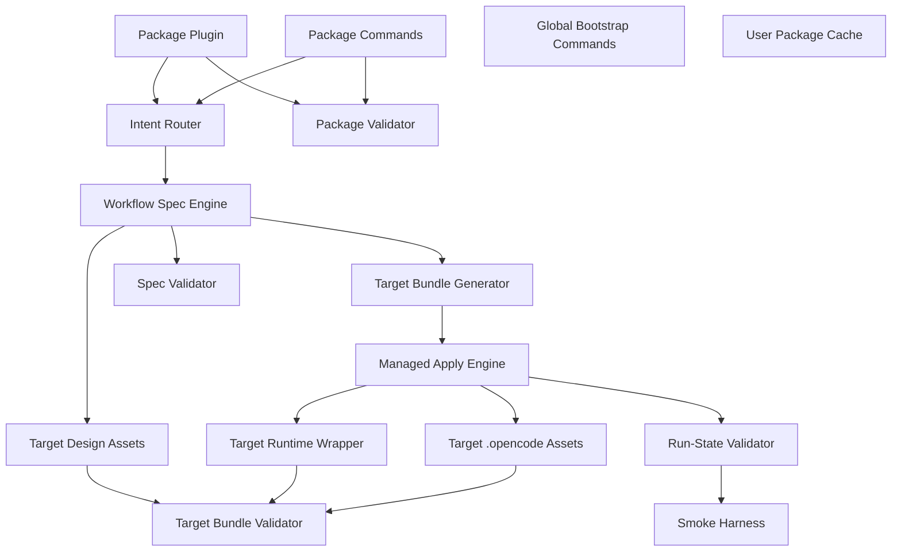
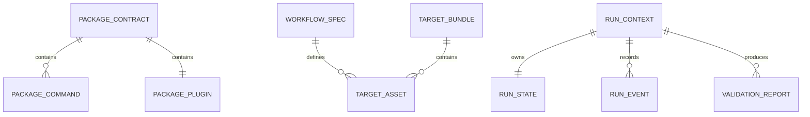
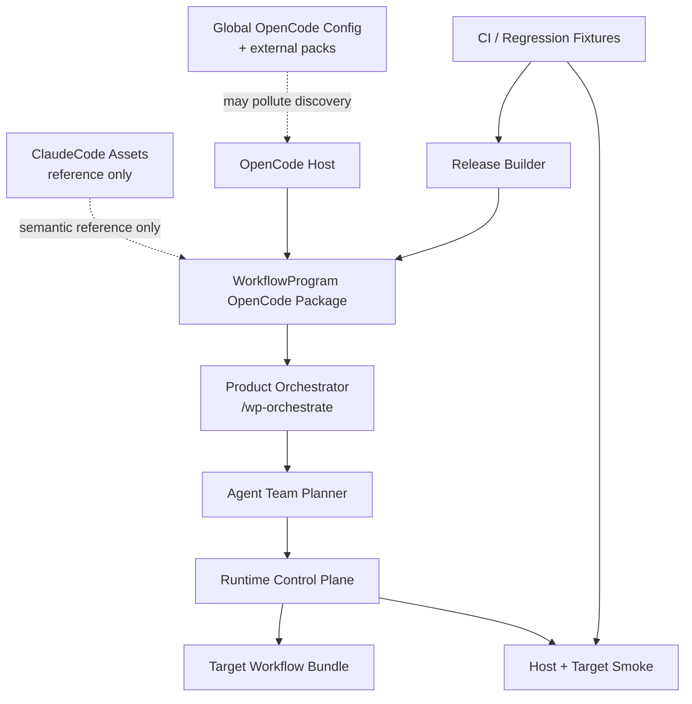

# OpenCode V2 架构设计说明书（HighLevel设计）

## 简介
### 目的与范围

本文档定义 WorkflowProgram OpenCode v2 的高层架构，重点回答两个问题：

1. WorkflowProgram 自身如何作为 OpenCode 产品包被宿主加载。
2. WorkflowProgram 如何为目标项目生成并交付可运行的目标工作流。

本文档覆盖：

- 系统边界与上下文
- 分层契约模型
- 关键架构元素与逻辑接口
- 运行、通信、日志、校验、部署的高层方案

本文档不覆盖：

- Claude 版兼容设计
- marketplace / npm 发布流程
- 非 OpenCode 宿主适配
- 具体脚本参数与类字段的实现级细节

### 核心架构与关键需求

本系统有三条主链路。

**链路 A：产品包加载链**

- 输入：`WP_PACKAGE_ROOT`
- 处理：OpenCode 自动发现 package commands 与 package plugin
- 输出：WorkflowProgram 产品能力被宿主加载，用户可执行 `/wp-*` 命令

**链路 B：目标工作流生成链**

- 输入：用户需求、目标项目路径、执行约束
- 处理：需求澄清 -> AI 设计/评审证据 -> runtime 固化 spec -> 目标 bundle 生成 -> managed apply -> 验证 -> lessons
- 输出：`TARGET_ROOT/.opencode/*`、`TARGET_ROOT/.workflowprogram/*`、`RUN_ROOT/*`

**链路 C：全局轻量部署链**

- 输入：用户全局 OpenCode 配置路径、用户级 package cache、当前项目路径
- 处理：全局 bootstrap command -> bootstrap runtime -> cached package -> project-local install
- 输出：当前项目获得完整 WorkflowProgram project-local 安装；全局路径只保留部署器，不承载完整产品包

关键需求列表如下：

| 编号 | 名称 | 描述 |
|---|---|---|
| AR-01 | 产品包可加载 | OpenCode 能稳定加载 WorkflowProgram 产品包 |
| AR-02 | 产品入口确定性 | WorkflowProgram 自身入口统一由 package commands 提供 |
| AR-03 | 契约分层清晰 | 产品包契约、工作流语义契约、目标交付契约、运行证据契约必须分层 |
| AR-04 | 目标工作流可生成 | 能为目标项目生成可运行的工作流 bundle |
| AR-05 | 写入受控 | 所有目标项目写入必须走 candidate + managed apply |
| AR-06 | 运行可回放 | 每次运行都必须产出最小证据集 |
| AR-07 | 包插件可扩展 | package plugin 支持 hook 与 custom tool |
| AR-08 | 校验分层 | package/spec/target/run-state 校验职责必须独立 |
| AR-09 | 名称空间隔离 | package commands / plugins 与 target commands / plugins 不得冲突 |
| AR-10 | 最小可安装 | v1 以 `package/` 作为部署源，通过安装脚本生成宿主可发现布局，不依赖额外构建产物 |
| AR-11 | 生命周期入口完整 | 产品 intent 必须覆盖 develop/validate/preflight/hotfix/iterate/ship/audit/evolve/orchestrate，且 command、runtime、spec flow 三者一致 |
| AR-12 | 团队编排可建模 | package agents 需要具备角色、阶段、触发条件和汇聚策略，支持 agentteam 与 subagent 执行机制分离 |
| AR-13 | 宿主隔离可诊断 | 能识别 OpenCode 全局配置、Claude 目录、oh-my-opencode 或其它外部资产对当前项目的污染风险 |
| AR-14 | 目标加载可验证 | smoke 必须区分 package host 可见性与 target workflow host reload 可见性 |
| AR-15 | 发布包可复现 | release 包必须从干净构建产物生成，不携带 runs、cache、node_modules 等本地运行痕迹 |
| AR-16 | 契约可演进 | spec、manifest、run-state、error code 必须具备版本与迁移策略 |
| AR-17 | 写入可恢复 | managed apply 必须支持冲突检测、并发锁、幂等性、回滚或可恢复失败 |
| AR-18 | 运行可审计 | 权限、隐私脱敏、日志保留、错误分类必须可被 validator 和 doctor 统一解释 |
| AR-19 | 平台边界明确 | WSL/Windows 路径、离线依赖、OpenCode 版本兼容和 plugin reload 规则必须显式记录 |
| AR-20 | 能力差距可追踪 | ClaudeCode 到 OpenCode 的能力映射必须维护为设计资产，明确已实现、不适用、待规划和替代实现 |
| AR-21 | 全局部署器轻量化 | 为改善新项目体验，可提供全局 bootstrap，但完整 WorkflowProgram 仍必须物化为 project-local 安装 |
| AR-22 | AI 协作层显式化 | `/wp-*` 命令必须由 OpenCode host/model 完成设计与回读确认，Python runtime 只消费已接受的 `workflow-spec.yaml` 并负责确定性校验、生成和写入 |

### 架构级原则与约束

系统必须长期遵守以下原则：

- `WorkflowProgram` 自身加载形式与目标工作流加载形式必须严格分层。
- `workflow-spec.yaml` 只描述目标工作流语义，不描述 WorkflowProgram 产品包自身。
- `WP_PACKAGE_ROOT`、`TARGET_ROOT`、`RUN_ROOT` 三个根路径的职责不可混用。
- WorkflowProgram 产品命令只能定义在 `WP_PACKAGE_ROOT/.opencode/commands/*.md`。
- `opencode.json.command` 不作为 WorkflowProgram 产品命令真源。
- WorkflowProgram package plugin 是 v1 必需资产，但 target workflow 是否生成 plugin 由目标 spec 决定。
- package plugin 与 target plugin 必须具备不同逻辑标识，避免 hook 与 tool 冲突。
- target commands 必须避免复用 `/wp-*` 产品命名空间。
- 目标工作流存在性只以 `TARGET_ROOT/.workflowprogram/design/workflow-spec.yaml` 为准；package manifest、package runtime、target runtime wrapper 或 runs 目录都不能单独作为 evolve/iterate/hotfix/ship 的路由依据。
- `project-local` 安装允许 package commands/plugins 与 target commands/plugins 共存于同一项目根，但 package runtime 必须位于 `.workflowprogram/package/runtime/`，不得与 target runtime 共用路径。
- 全局 bootstrap 只允许安装 `/wp-install`、`/wp-status`、`/wp-upgrade`、`/wp-uninstall` 以及 bootstrap runtime；不得全局安装完整 lifecycle commands、agents 或 package plugin。
- 用户级 package cache 只能作为安装源，不作为运行时真源；项目一旦安装完成，运行时应以项目本地 manifest 和 `.workflowprogram/package/runtime/` 为准。
- status 与 orchestrate 输出必须同时暴露 `project_package_installed` 与 `target_workflow_exists`，禁止用泛化的 `.workflowprogram` 目录推断状态。
- package runtime 的 Python 依赖必须显式声明；v1 通过 `requirements.txt` 声明，并允许安装器创建 `.workflowprogram/package/.venv` 作为专用解释器。
- package command 可以通过 `agent-team-planner.py` 或 `team-plan` 获取可选 agent 调度建议；planner 输出不是 mutation 成功条件。
- `/wp-develop` 默认必须先完成交互式澄清、设计回读确认并形成 `workflow-spec.md` / `workflow-spec.yaml`；未确认请求或缺少 accepted spec 时只能产出 blocking questions/WARN，不得直接生成 target bundle。`--ai-evidence` 仅是 legacy 诊断字段，不能替代 accepted spec 或用户确认。
- Python runtime 不直接调用 OpenCode subagent；OpenCode host 或用户显式调用 package agents，runtime 记录和校验可回放证据。
- 任何运行时依赖的 validator 脚本都必须随 `WP_PACKAGE_ROOT` 一起交付，不得依赖仓库根目录中的额外源码。
- 所有目标写入必须先生成 candidate，再执行 managed apply。
- 所有运行态结论都必须能够由 `RUN_ROOT` 证据回放。
- validator 不能跨层检查不属于自己的契约。
- 设计优先保证边界清晰和可验证性，不优先追求抽象复用。

## 系统模型
### 上下文模型
#### 上下文图



#### 外部接口描述

| 接口名 | 提供者 | 使用者 | 协议/机制 | 功能描述 |
|---|---|---|---|---|
| Package Load Interface | OpenCode Host | WorkflowProgram 产品包 | 本地目录自动发现 | 加载 package commands、package agents 与 package plugin |
| Bootstrap Command Interface | Global Bootstrap | 用户 | OpenCode global Markdown command | 提供 `/wp-install`、`/wp-status`、`/wp-upgrade`、`/wp-uninstall` 项目部署入口 |
| Bootstrap Cache Interface | Global Bootstrap | Project Installer | 文件系统 + manifest | 从用户级版本化 cache 读取完整 package 作为 project-local 安装源 |
| Package Command Interface | WorkflowProgram 包 | 用户 | Markdown command | 提供 `/wp-develop`、`/wp-validate` 等产品入口 |
| Package Plugin Interface | WorkflowProgram 包 | OpenCode Host | `.opencode/plugins/*.ts` | 注册 hook/custom tool |
| Runtime Entry Interface | WorkflowProgram Runtime | Package Command | 本地脚本调用 | 承接产品命令后的确定性编排 |
| Target Bundle Delivery Interface | WorkflowProgram Runtime | TARGET_ROOT | 文件系统 + managed apply | 交付目标工作流 bundle |
| Target Runtime Interface | Generated Target Workflow | OpenCode Host | 必选 `.workflowprogram/runtime/*` + 条件性 `.opencode/*` | 目标工作流自身被宿主加载与运行 |
| Evidence Interface | WorkflowProgram Runtime | validator/judge | JSON/JSONL/Markdown 文件 | 输出 state、events、report、summary |

### 关键需求模型
#### KR-01 产品包加载



#### KR-02 `/wp-develop` 生成目标工作流



#### KR-03 目标工作流被宿主加载



#### KR-04 校验分层



#### KR-05 全局 bootstrap 部署到新项目



## 系统架构设计模型
### 逻辑模型
#### 1层逻辑模型



#### 2层逻辑模型



#### 产品包契约（Package Contract）

产品包契约只约束 WorkflowProgram 自身被宿主加载的形式。

| 项目 | 规则 |
|---|---|
| 真源根路径 | `WP_PACKAGE_ROOT` |
| 真源命令目录 | `project-local`: `WP_PACKAGE_ROOT/.opencode/commands/`; `global`: `WP_PACKAGE_ROOT/commands/` |
| 真源 agents 目录 | `project-local`: `WP_PACKAGE_ROOT/.opencode/agents/`; `global`: `WP_PACKAGE_ROOT/agents/` |
| 真源插件目录 | `project-local`: `WP_PACKAGE_ROOT/.opencode/plugins/`; `global`: `WP_PACKAGE_ROOT/plugins/` |
| 真源运行时目录 | `WP_PACKAGE_ROOT/.workflowprogram/package/runtime/` |
| 部署源目录 | 仓库内 `package/.workflowprogram/runtime/` 作为安装源，不直接等同于已安装布局 |
| 产品命令命名空间 | `/wp-*` |
| 产品 agents 形态 | v1 必需，作为 package review/analysis 能力集随产品包交付 |
| 产品插件职责 | hook/custom tool/bridge |
| 产品命令定义位置 | 仅已安装 commands 目录中的 `wp-*.md` |
| 非真源位置 | `opencode.json.command` 不承载 WorkflowProgram 产品命令真源 |

#### 目标工作流交付契约（Target Bundle Contract）

目标交付契约只约束生成物如何被目标项目加载与运行。

| 项目 | 规则 |
|---|---|
| 目标根路径 | `TARGET_ROOT` |
| 目标命令目录 | `TARGET_ROOT/.opencode/commands/`（可选，由 target `workflow-spec.yaml` 决定是否生成） |
| 目标设计目录 | `TARGET_ROOT/.workflowprogram/design/` |
| 目标运行时目录 | `TARGET_ROOT/.workflowprogram/runtime/` |
| 目标写入方式 | candidate + managed apply |
| 目标插件策略 | 默认可选，由目标 `workflow-spec.yaml` 决定是否生成 |
| 目标命令命名 | 不得占用 `/wp-*` 产品命名空间 |
| 目标工作流真源 | `workflow-spec.yaml` 描述目标工作流语义与目标交付需求 |

#### 逻辑接口设计

| 接口名 | 提供者 | 使用者 | 功能描述 |
|---|---|---|---|
| `PackageCommand.Dispatch` | Package Commands | Intent Router | 接收用户产品入口并规范化参数 |
| `PluginBridge.Hook` | Package Plugin | Runtime / Host | 提供 hook 与 custom tool |
| `SpecEngine.Build` | Workflow Spec Engine | Target Bundle Generator | 生成机器可读工作流语义 |
| `TargetBundle.Emit` | Target Bundle Generator | Managed Apply Engine | 输出 target candidate bundle |
| `ManagedApply.Apply` | Managed Apply Engine | TARGET_ROOT | 受控应用候选资产 |
| `Validator.PackageCheck` | Package Validator | CI / Runtime | 校验 package contract |
| `Validator.SpecCheck` | Spec Validator | CI / Runtime | 校验 workflow semantics |
| `Validator.TargetCheck` | Target Bundle Validator | CI / Runtime | 校验 target bundle contract |
| `Validator.RunStateCheck` | Run-State Validator | CI / Runtime | 校验运行证据契约 |

#### 系统元素清单

| 元素名 | 功能描述 | 提供的逻辑接口 | 上级系统 |
|---|---|---|---|
| Package Commands | 提供 `/wp-*` 产品入口 | `PackageCommand.Dispatch` | 产品包层 |
| Package Plugin | 提供 hook/custom tool/bridge | `PluginBridge.Hook` | 产品包层 |
| Intent Router | 标准化 intent 和上下文 | `Route.Intent` | 设计控制层 |
| Workflow Spec Engine | 构建目标工作流语义 | `SpecEngine.Build` | 设计控制层 |
| Target Bundle Generator | 生成目标 bundle | `TargetBundle.Emit` | 设计控制层 |
| Managed Apply Engine | 管理 candidate/apply | `ManagedApply.Apply` | 设计控制层 |
| Package Validator | 校验产品包加载契约 | `Validator.PackageCheck` | 证据与校验层 |
| Spec Validator | 校验目标工作流语义契约 | `Validator.SpecCheck` | 证据与校验层 |
| Target Bundle Validator | 校验目标交付契约 | `Validator.TargetCheck` | 证据与校验层 |
| Run-State Validator | 校验运行证据契约 | `Validator.RunStateCheck` | 证据与校验层 |
| Smoke Harness | 运行最小真实链路验证 | `Smoke.Run` | 证据与校验层 |

### 技术模型
#### 运行框架

运行框架由三个根路径组成：

| 根路径 | 角色 | 说明 |
|---|---|---|
| `WP_PACKAGE_ROOT` | 已安装产品包根路径 | 被 OpenCode 直接加载的 WorkflowProgram 包 |
| `TARGET_ROOT` | 目标项目根路径 | 目标工作流最终落地位置 |
| `RUN_ROOT` | 运行证据根路径 | 存放 state / events / reports / outputs |

运行框架规则：

- OpenCode 只直接加载 `WP_PACKAGE_ROOT` 或 `TARGET_ROOT` 中的 OpenCode 资产。
- WorkflowProgram package runtime 在部署后位于 `WP_PACKAGE_ROOT/.workflowprogram/package/runtime/`。
- 目标工作流 runtime wrapper 位于 `TARGET_ROOT/.workflowprogram/runtime/`。
- WorkflowProgram package plugin 与 target workflow plugin 不能共享文件名、逻辑 id 或职责。

#### 通信框架

通信仅允许使用下列机制：

| 通信方向 | 机制 |
|---|---|
| 用户 -> Package Command | OpenCode Markdown command |
| Package Command -> Runtime | 本地脚本调用 |
| Package Plugin -> Host | 本地插件自动加载 |
| Runtime -> Target Bundle | 文件系统 candidate 生成 |
| Runtime -> Managed Apply | plan/result 文件契约 |
| Runtime -> Validators | JSON/YAML/Markdown 文件契约 |
| Validators -> 用户 | Markdown/JSON 报告 |

#### OM框架

生命周期、日志、状态管理统一采用：

- 生命周期：package load -> intent dispatch -> stage execution -> validate -> lessons
- 状态快照：`RUN_ROOT/state.json`
- 事件日志：`RUN_ROOT/events.jsonl`
- 阶段总结：`RUN_ROOT/outputs/stages/*.json`
- 进展摘要：`RUN_ROOT/outputs/progress/*`
- Lessons：`RUN_ROOT/outputs/stages/s6-lessons-delta.md`

#### 接口实现机制

| 机制名 | 机制说明 | 使用实例 |
|---|---|---|
| Markdown Command | OpenCode 用户入口机制 | `/wp-develop`、`/wp-validate` |
| Local Plugin Auto Load | OpenCode 本地插件机制 | `workflowprogram.ts` |
| File Contract | 用文件传递控制面语义和运行结果 | `workflow-spec.yaml`、`managed-files.json` |
| Managed Apply | 防止静默覆盖的受控写入机制 | candidate -> plan -> apply |
| Run Evidence | 把运行过程结构化落盘 | `state.json`、`events.jsonl` |
| Layered Validation | 不同 validator 校验不同契约层 | package/spec/target/run-state |

### 数据模型
#### 静态数据模型



#### 数据所有权模型

| 数据实体 | 所有者 | 读 | 写 | 无权限 |
|---|---|---|---|---|
| Package Contract | 产品包层 | Host / Package Validator | package builder | target runtime |
| Workflow Spec | Workflow Spec Engine | generator / Spec Validator | spec engine | package loader |
| Target Bundle | Target Bundle Generator | target validator / target runtime | generator / apply engine | package loader |
| Managed Manifest | Managed Apply Engine | runtime / validator | apply engine | package loader |
| Run State | Runtime Orchestrator | validators / judge | runtime | package loader |
| Validation Report | Validation Layer | user / runtime | validators | package loader |

### 代码模型

建议工程路径如下：

```text
opencode-v2/
├── design/
│   ├── opencode-v2-highlevel-design.md
│   ├── opencode-v2-lowlevel-design.md
│   └── opencode-v2-validation-matrix.md
├── package/
│   ├── opencode.json
│   ├── .opencode/
│   │   ├── commands/
│   │   ├── plugins/
│   │   ├── agents/      # required in v1
│   │   └── skills/      # optional
│   └── .workflowprogram/
│       └── runtime/
│           └── validators/
│               ├── package_contract_validator.py
│               ├── workflow_spec_validator.py
│               ├── target_bundle_validator.py
│               └── run_state_validator.py
└── tests/
```

### 构建模型

v1 采用 `source-as-deployment-source` 模式。

| 项目 | 结论 |
|---|---|
| `dist/opencode/` | 非 v1 前置项 |
| `build_opencode.py` | 非 v1 前置项 |
| 仓库内 `package/` 是否作为部署源 | 是，且必须自包含 runtime 与 validator |
| 是否需要安装器生成宿主可发现布局 | 是 |
| package 是否必须有 plugin metadata | 否 |

### 交付部署模型

推荐支持两种产品包部署模式：

| 模式 | 路径 | 用途 |
|---|---|---|
| project-local | `PROJECT_ROOT/.opencode/{commands,plugins}` + `PROJECT_ROOT/.workflowprogram/package/runtime/` | 当前项目内安装与直接使用 |
| global | `GLOBAL_ROOT/{commands,plugins}` + `GLOBAL_ROOT/.workflowprogram/package/runtime/` | 全局安装，供多个项目复用 |

安装规则：

- 安装器部署 WorkflowProgram 产品命令、产品 agents、产品插件和 package runtime。
- `project-local` 安装允许 package commands/plugins 与后续生成的 target commands/plugins 共存于同一项目根目录。
- package runtime 固定落在 `.workflowprogram/package/runtime/`，用于与 target `.workflowprogram/runtime/` 做路径隔离。
- package runtime 依赖通过 `.workflowprogram/package/runtime/requirements.txt` 声明；安装器可选创建 `.workflowprogram/package/.venv`，并在 install manifest 中记录 `python_executable`。
- 安装器以保守合并策略更新 `opencode.json`，并写出 install manifest 以支持状态检查和卸载。

目标工作流只允许一种交付模型：

- 必选：交付到 `TARGET_ROOT/.workflowprogram/*`
- 可选：按 target spec 交付到 `TARGET_ROOT/.opencode/*`

目标工作流部署与产品包部署必须逻辑独立：

- 部署 WorkflowProgram 产品包，不代表自动部署目标工作流
- 生成目标工作流，不得回写 WorkflowProgram 产品包目录

## 差距闭环扩展架构

本节定义从当前 OpenCode v2 核心链路继续补齐 ClaudeCode 版能力时的架构级改动目标。这里的目标不是复制 ClaudeCode 的 `.claude` 加载模型，而是把等价产品能力落到 OpenCode 的 command、agent、plugin、runtime、validator 与 smoke 机制上。

### 改动目标总表

| 目标编号 | 目标 | 归属层 | 实现方向 | 优先级 |
|---|---|---|---|---|
| GC-01 | 补齐 `audit`、`evolve`、`orchestrate` 产品生命周期入口 | 产品包层 / 设计控制层 | 新增 `/wp-audit`、`/wp-evolve`、`/wp-orchestrate`，并同步 runtime intent 与 spec `intent_flows` | P1 |
| GC-02 | 建立 agentteam 编排模型 | 设计控制层 | 给 package agents 增加角色元数据，新增 team plan、dispatch、fan-in 汇聚和 reviewer quorum | P1 |
| GC-03 | 增加测试场景生成角色 | 产品包层 / 校验层 | 新增 `test-scenario-generator` agent，并接入 validate/audit/evolve 的证据生成 | P1 |
| GC-04 | 建立宿主隔离与兼容诊断 | 产品包层 / OM层 | doctor 识别全局 OpenCode 配置、Claude 资产串入、oh-my-opencode 资产、OpenCode 版本与 plugin reload 状态 | P1 |
| GC-05 | 建立 target host reload smoke | 校验层 | 在 develop 生成 target command/plugin 后重启或重新进入 OpenCode host，验证 target 可发现性 | P1 |
| GC-06 | 建立 release build 产物 | 构建层 / 部署层 | 新增 package build，把 `package/` 清洗为 `dist/opencode/` 或 release archive | P2 |
| GC-07 | 增加 schema version 与 migration | 数据层 | 对 workflow spec、managed manifest、run-state、install manifest 增加版本与迁移器 | P2 |
| GC-08 | 强化 managed apply | 目标交付层 | 增加并发锁、幂等 diff、冲突解释、失败恢复和 rollback manifest | P2 |
| GC-09 | 建立统一错误码与权限策略 | OM层 / 安全层 | 统一 runtime、validator、doctor、plugin hook 的 error code 与 permission policy | P2 |
| GC-10 | 增加深度 validator 与 fixtures | 校验层 | 补 workflow draft、lowlevel、generated runtime、lessons delta、clarification review 与 golden fixtures | P2 |
| GC-11 | 增强安装生命周期 | 部署层 | 覆盖 upgrade/uninstall/status/offline install/dependency lock/WSL-Windows path 场景 | P2 |
| GC-12 | 建立能力映射矩阵 | 设计资产 | 维护 ClaudeCode capability -> OpenCode capability 的状态矩阵 | P1 |

### 扩展上下文模型



### 扩展逻辑元素

| 元素名 | 功能描述 | 提供的逻辑接口 | 上级系统 |
|---|---|---|---|
| Product Orchestrator | 识别用户意图并路由到 develop/validate/preflight/hotfix/iterate/ship/audit/evolve | `Orchestrator.Route` | 设计控制层 |
| Intent Contract Registry | 维护 command、runtime intent、spec flow 的一致性 | `IntentContract.Resolve` | 设计控制层 |
| Agent Role Registry | 维护 agent 的角色、阶段、能力、触发条件 | `AgentRole.Resolve` | 设计控制层 |
| Agent Team Planner | 根据目标工作流阶段规划 agentteam，生成 host-mediated subagent 调度建议和汇聚策略 | `AgentTeam.Plan` | 设计控制层 |
| Host Isolation Doctor | 检查宿主配置污染、全局资产串入、OpenCode 版本与 reload 状态 | `HostIsolation.Check` | OM层 |
| Target Host Smoke Runner | 验证 target command/plugin 被真实 OpenCode host 发现 | `TargetHostSmoke.Run` | 校验层 |
| Release Builder | 生成干净发布包和完整性清单 | `Release.Build` | 构建层 |
| Migration Engine | 对 spec、manifest、run-state 做版本迁移 | `Migration.Apply` | 数据层 |
| Error Taxonomy | 统一错误码、失败分类与 remediation 文案 | `ErrorTaxonomy.Lookup` | OM层 |
| Capability Parity Matrix | 记录 ClaudeCode 能力与 OpenCode 能力状态 | `Parity.Query` | 设计资产 |

### 扩展数据所有权

| 数据实体 | 所有者 | 读 | 写 | 无权限 |
|---|---|---|---|---|
| Intent Contract Registry | Product Orchestrator | runtime / validator / docs | package maintainer | target runtime |
| Agent Role Registry | Agent Team Planner | orchestrator / runtime | package maintainer | target runtime |
| Team Plan | Agent Team Planner | runtime / validators | runtime | package loader |
| Host Isolation Report | Host Isolation Doctor | user / doctor / smoke | doctor | target workflow |
| Target Host Smoke Report | Target Host Smoke Runner | CI / user | smoke runner | package builder |
| Release Manifest | Release Builder | installer / CI | release builder | target workflow |
| Migration Manifest | Migration Engine | validators / runtime | migration engine | host loader |
| Error Code Registry | Error Taxonomy | all runtime components | package maintainer | target workflow |
| Capability Parity Matrix | package maintainer | user / planner | package maintainer | runtime mutators |

### 架构决策

| 决策 | 结论 |
|---|---|
| ClaudeCode 能力是否直接复制路径 | 不复制；只做语义级能力映射 |
| OpenCode package 是否仍是独立项目 | 是；所有新增能力必须先落到 OpenCode 独立仓库的 package/runtime/docs/spec |
| `audit` 不一致如何处理 | 必须补 `/wp-audit` 与 runtime handler，或移除 spec 中的 `audit` flow；优先补齐 |
| agentteam 与 subagent 是否等价 | 不等价；agentteam 是阶段职责与团队结构，subagent 是执行机制 |
| runtime 是否直接执行 OpenCode subagent | v1 不直接执行；runtime 生成 `team-plan.json/md`，由 OpenCode host 或用户按建议显式调用 package agent，并以独立 agent 输出作为执行证据 |
| target host smoke 是否替代 package host smoke | 不替代；二者分别验证产品包可见性和目标工作流可见性 |
| release build 是否替代 `package/` 部署源 | 不替代 v1 安装路径；作为发布和 CI 的干净产物来源 |
    A0 --> A3
    A0 --> B1

## Graph Workflow Target Model

The current target direction is graph-shaped workflow design, not a fixed S1-S6 slot pipeline.

- AI defines request-specific stage nodes and transitions inside the accepted workflow spec.
- The framework keeps the spec shape, validation, generation, and managed apply mechanics.
- Reusable behaviors such as clarification, validation, self-iteration, merge, and handoff may be expressed as optional capability templates or subgraphs.
- Shared context semantics are part of the workflow design itself.
- Read/write permissions are intentionally deferred to a later task and are not part of this change.

This means the following should be treated as transitional implementation details rather than target design facts:

- fixed stage-slot naming
- fixed intent-to-stage tables
- any hardcoded assumption that every workflow must contain S1-S6
