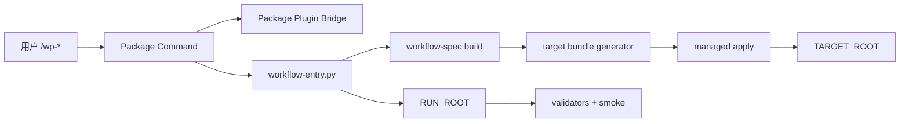
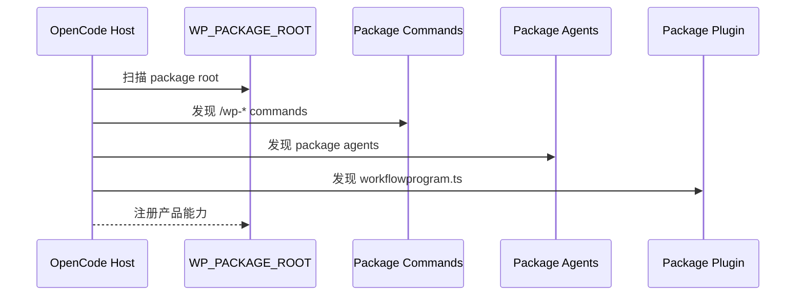
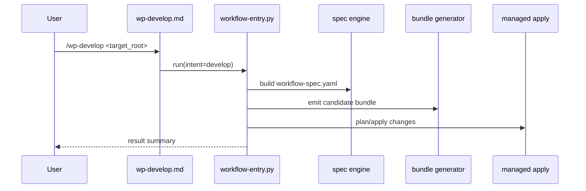
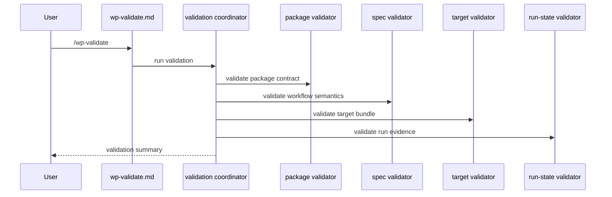

# OpenCode V2 特性设计说明书（LowLevel设计）

## 目的与范围

本文档给出 WorkflowProgram OpenCode v2 的实现级设计，面向实现者回答以下问题：

- WorkflowProgram 产品包如何组织命令、插件与运行时
- `/wp-*` 产品命令如何进入 runtime 主链
- `workflow-spec.yaml` 如何作为目标工作流语义真源
- 目标 bundle 如何生成、校验并受控写入
- package/spec/target/run-state 四层校验如何分工

本文档遵循 [opencode-v2-highlevel-design.md](./opencode-v2-highlevel-design.md)。

## 特性相关需求列表

| 编号 | 需求名称 | 特性描述 |
|---|---|---|
| FR-01 | Package Auto Load | OpenCode 自动加载 WorkflowProgram 产品包 |
| FR-02 | Command Namespace | 产品命令必须使用 `/wp-*` 命名空间 |
| FR-03 | Plugin Bridge | package plugin 提供 hook 与 custom tool 能力 |
| FR-04 | Runtime Entry | 产品命令统一进入 `workflow-entry.py` |
| FR-05 | Spec Build | runtime 生成目标工作流语义 spec |
| FR-06 | Target Bundle Emit | runtime 生成目标 `.opencode/*` 与 `.workflowprogram/*` |
| FR-07 | Managed Apply | 所有目标项目写入必须走 candidate + managed apply |
| FR-08 | Target Runtime Wrapper | 目标工作流必须交付自己的 runtime wrapper |
| FR-09 | Layered Validation | package/spec/target/run-state 分层校验 |
| FR-10 | Runtime Evidence | 每次运行产出最小证据集 |
| FR-11 | Package/Target Isolation | 产品包资产与目标工作流资产必须隔离 |
| FR-12 | Name Collision Avoidance | package command/plugin 与 target command/plugin 不得冲突 |
| FR-13 | Install & Deploy | 通过安装脚本把 `package/` 部署成 OpenCode 可发现布局 |

## 特性分析
### 使用场景分析

| 场景 | 触发条件与对象 | 子场景 | 关键任务操作 |
|---|---|---|---|
| UC-01 产品包加载 | 用户启动 OpenCode；对象为 `WP_PACKAGE_ROOT` | 首次加载、重复加载 | 发现 package command、发现 package plugin、校验包完整性 |
| UC-02 设计目标工作流 | 用户执行 `/wp-develop` | 新建设计、已有设计覆盖更新 | 解析 target root、生成 spec、生成 bundle、managed apply、验证 |
| UC-03 校验目标工作流 | 用户执行 `/wp-validate` | 静态校验、运行校验 | 校验 spec、校验 target bundle、校验 run-state |
| UC-04 受控写入冲突 | 目标项目已有同路径文件 | 可自动更新、需要人工处理 | candidate 生成、冲突检测、输出 plan/result |
| UC-05 插件能力接入 | package plugin 已被宿主加载 | hook、custom tool | 仅提供 runtime 所必需能力，不替代 runtime 主链 |
| UC-06 目标工作流被宿主加载 | 目标 bundle 已交付到 `TARGET_ROOT` | commands only、commands + plugin | 宿主扫描 target OpenCode 资产并注册 |
| UC-07 产品包安装部署 | 用户执行安装脚本 | project-local、global、状态检查、卸载 | 复制产品命令/插件/runtime、合并配置、写 install manifest |

### 影响分析
#### 依赖与技术限制

- 依赖 OpenCode 已安装。
- 依赖 `python3` 可运行 runtime / validator 脚本。
- runtime 当前依赖 `PyYAML`，并通过 `requirements.txt` 显式声明。
- 安装器可选创建 `.workflowprogram/package/.venv`，并把后续命令执行绑定到该解释器。
- WorkflowProgram 产品命令只允许来自 `.opencode/commands/*.md`。
- WorkflowProgram package plugin 必须可被 `.opencode/plugins/` 自动加载。
- `workflow-spec.yaml` 只描述目标工作流语义，不承载产品包契约。
- target bundle 不能反向污染 `WP_PACKAGE_ROOT`。
- package plugin 与 target plugin 不得复用同名逻辑标识。
- package 运行时与分层 validator 必须随 `WP_PACKAGE_ROOT` 一起交付，不能依赖仓库根路径中的额外脚本。
- v1 不依赖 `dist/opencode/`，但需要安装脚本把 `package/` 物化成宿主可发现布局。

#### 硬件限制

- 无特殊硬件要求。
- 需要稳定本地磁盘与可执行子进程环境。
- 大型项目场景下，candidate bundle 和 `RUN_ROOT` 会带来额外 I/O 成本。

### 公开/业界方案分析

对当前场景，最合适的是“命令入口 + 本地插件 + 文件契约 + 受控写入”的组合，而不是把所有控制面逻辑塞进插件或大提示词。

| 方案 | 优点 | 缺点 | 结论 |
|---|---|---|---|
| 纯 plugin 驱动 | 宿主耦合强、交互自然 | 容易把运行控制面塞进插件，难验证 | 不采用 |
| 纯 prompt/skill 驱动 | 灵活 | 不确定、难追踪、边界弱 | 不采用 |
| command + runtime 脚本 | 控制清晰、易审计 | 需要维护脚本链 | 采用 |
| command + plugin bridge + runtime | 兼顾 hook/tool 与控制面 | 需要明确边界 | v1 采用 |

## 特性/功能实现原理
### 总体方案

### 特性功能设计

建议拆成 6 个特性模块：

| 模块 | 作用 | 所属契约层 |
|---|---|---|
| F1 Package Load | 加载 WorkflowProgram 产品包 | 产品包契约 |
| F2 Package Entry | `/wp-*` 命令分发 | 产品包契约 |
| F3 Plugin Bridge | 提供 hook/custom tool | 产品包契约 |
| F4 Workflow Semantics Build | 生成目标工作流语义 spec | 工作流语义契约 |
| F5 Target Bundle Delivery | 生成并写入目标 bundle | 目标交付契约 |
| F6 Evidence & Validation | 运行证据与分层校验 | 运行证据契约 |

### UC-01 产品包加载实现
#### 设计思路

- `WP_PACKAGE_ROOT` 作为 WorkflowProgram 产品包根目录。
- OpenCode 启动后自动扫描 `.opencode/commands/*.md`、`.opencode/agents/*.md` 和 `.opencode/plugins/*.ts`。
- package validator 在本地或 CI 中检查产品包契约完整性。
- 加载结果不应依赖 `workflow-spec.yaml`。

#### 实体关系分析

| 实体 | 说明 |
|---|---|
| `PackageManifest` | package 根目录及关键文件集合 |
| `PackageCommand` | 产品命令定义 |
| `PackageAgent` | 产品 agent 定义 |
| `PackagePlugin` | 产品插件定义 |
| `PackageCompatibility` | package 对宿主能力的兼容描述 |

#### 时序分析

### UC-02 `/wp-develop` 实现
#### 设计思路

- 产品命令只负责入口参数归一化。
- 所有阶段编排统一进入 `workflow-entry.py`。
- `workflow-entry.py` 负责创建 `RUN_ROOT`、解析 `TARGET_ROOT`、调度 spec 构建和 bundle 生成。
- 目标项目写入统一走 candidate -> plan -> apply。

#### 实体关系分析

| 实体 | 说明 |
|---|---|
| `PackageCommandContext` | `/wp-develop` 的解析上下文 |
| `TargetContext` | `TARGET_ROOT` 相关上下文 |
| `RunContext` | `RUN_ROOT` 与本次执行参数 |
| `WorkflowSpecModel` | 目标工作流语义模型 |
| `CandidateBundle` | 待应用目标 bundle |
| `ManagedPlan` | candidate 与 target 的差异计划 |
| `ManagedResult` | apply 执行结果 |

#### 时序分析

### UC-03 `/wp-validate` 实现
#### 设计思路

- `/wp-validate` 是产品命令，不是 target command。
- 它校验的是：
  - WorkflowProgram 产品链是否能正确读取并理解目标工作流
  - `TARGET_ROOT` 现有资产是否满足目标交付契约
  - `RUN_ROOT` 证据是否闭合
- 它调用的 validator 必须来自当前 package runtime 对应的 `validators/` 目录；部署后路径为 `WP_PACKAGE_ROOT/.workflowprogram/package/runtime/validators/`。

#### 实体关系分析

| 实体 | 说明 |
|---|---|
| `ValidationRequest` | 校验请求 |
| `PackageValidationSummary` | 产品包校验结果 |
| `SpecValidationSummary` | 语义 spec 校验结果 |
| `TargetValidationSummary` | 目标 bundle 校验结果 |
| `RunStateValidationSummary` | 运行态证据校验结果 |

#### 时序分析

### UC-04 受控写入冲突实现
#### 设计思路

- 目标工作流生成结果先落到 candidate 目录。
- `managed-assets.py` 比较 candidate 与 target 状态。
- 冲突产出 `managed-change-plan.json` 和 `managed-change-result.json`。
- 未经明确规则允许，不能静默覆盖目标文件。

#### 实体关系分析

| 实体 | 说明 |
|---|---|
| `CandidateAsset` | 候选文件 |
| `ManagedDiff` | 差异条目 |
| `ManagedPlan` | 变更计划 |
| `ManagedManifest` | 已管理文件清单 |
| `ConflictRecord` | 冲突记录 |

### UC-05 Package Plugin Bridge 实现
#### 设计思路

- `workflowprogram.ts` 只承担 package plugin bridge 职责。
- 它可以做：
  - 注册最小 hook
  - 暴露 custom tool
  - 为 package commands 或 runtime 提供桥接能力
- 它不应做：
  - 替代 `workflow-entry.py`
  - 直接实现完整 stage runner
  - 同时承载 target workflow plugin 逻辑

#### 实体关系分析

| 实体 | 说明 |
|---|---|
| `PackagePluginBridge` | WorkflowProgram 产品插件桥接器 |
| `HookBinding` | hook 绑定定义 |
| `ToolBinding` | custom tool 绑定定义 |
| `PluginRuntimeContext` | 插件执行上下文 |

### UC-06 目标工作流被宿主加载
#### 设计思路

- 目标工作流被宿主加载，属于 target bundle contract。
- v1 当前由目标 `workflow-spec.yaml` 控制的 host-visible 交付物只有 target commands 与 target plugins。
- v1 默认至少交付：
  - target `.workflowprogram/design/*`
  - target `.workflowprogram/runtime/*`
- target `.opencode/commands/*`、`.opencode/plugins/*` 是否交付，取决于具体目标工作流模式。
- target agents / skills 仍保留为后续扩展，不属于当前实现范围。

### UC-07 产品包安装部署
#### 设计思路

- 仓库内 `package/` 作为部署源，不直接等同于宿主最终加载布局。
- 安装脚本支持：
  - `project-local`：把产品命令和插件部署到项目根 `.opencode/`，把 package runtime 部署到 `.workflowprogram/package/runtime/`
  - `global`：把产品命令和插件部署到全局 config root，把 package runtime 部署到 `.workflowprogram/package/runtime/`
- `project-local` 安装允许 package assets 与 target assets 共存，但依赖命名空间隔离与 runtime 路径隔离。
- 安装器只保守合并 `opencode.json` 中 package 所需的 `permission.bash` 和 `watcher.ignore`。
- 若启用 `--create-venv`，安装器使用指定 base Python 创建 `.workflowprogram/package/.venv`，再执行 `pip install -r requirements.txt`。
- 安装器必须写 install manifest，用于状态检查和卸载。

#### 实体关系分析

| 实体 | 说明 |
|---|---|
| `TargetBundleManifest` | 目标 bundle 清单 |
| `TargetCommand` | 目标项目命令 |
| `TargetRuntimeWrapper` | 目标项目 runtime wrapper |
| `TargetPlugin` | 目标项目插件，可选 |

### Story划分与依赖设计（use case分解为story）

| Story | 说明 | 依赖 |
|---|---|---|
| S1 | 建立 `WP_PACKAGE_ROOT` 目录结构 | 无 |
| S2 | 实现 `workflowprogram.ts` package plugin bridge 骨架 | S1 |
| S3 | 实现 `/wp-develop`、`/wp-validate` package commands | S1 |
| S4 | 实现 root 解析与 `RunContext` | S1 |
| S5 | 实现 workflow spec 生成链路 | S4 |
| S6 | 实现 target bundle generator | S5 |
| S7 | 实现 managed apply | S6 |
| S8 | 实现 package/spec/target/run-state validators | S4-S7 |
| S9 | 实现 smoke harness | S8 |
| S10 | 实现 target runtime wrapper 验证 | S6-S8 |

### 模块与接口设计

| 模块 | 关键接口 | 说明 |
|---|---|---|
| `package_contract` | `validate_package_root(root)` | 校验 WorkflowProgram 产品包 |
| `package_command_router` | `dispatch(intent, args)` | 标准化产品命令上下文 |
| `package_plugin_bridge` | `register_hooks()` / `register_tools()` | 注册最小 hook/tool |
| `runtime_context` | `build_context(package_root, target_root)` | 统一根路径与运行上下文 |
| `workflow_spec_engine` | `build_spec(context)` | 生成目标工作流语义 |
| `target_bundle_generator` | `emit_candidate(spec, target_root)` | 生成 target candidate bundle |
| `managed_apply_engine` | `plan_apply(candidate, target_root)` | 受控写入目标项目 |
| `validation_coordinator` | `run_validations(context)` | 组织四层校验 |
| `evidence_writer` | `write_state()` / `write_event()` / `write_report()` | 输出运行证据 |

### story设计
#### 类设计

推荐保持“轻 dataclass + service module”风格，不引入过重 OOP。

| 类/数据对象 | 作用 |
|---|---|
| `PackageContext` | 表示 `WP_PACKAGE_ROOT` 上下文 |
| `TargetContext` | 表示 `TARGET_ROOT` 上下文 |
| `RunContext` | 表示 `RUN_ROOT` 与运行参数 |
| `WorkflowSpecModel` | 表示目标工作流语义模型 |
| `CandidateBundle` | 表示待应用目标 bundle |
| `ManagedPlan` | 表示 apply 计划 |
| `ValidationSummary` | 表示分层校验结果 |

#### 实现设计

建议文件职责如下：

| 文件 | 职责 |
|---|---|
| `package/.opencode/commands/wp-develop.md` | 产品设计入口 |
| `package/.opencode/commands/wp-validate.md` | 产品校验入口 |
| `package/.opencode/plugins/workflowprogram.ts` | package plugin bridge |
| `package/.workflowprogram/runtime/workflow-entry.py` | 主入口编排 |
| `package/.workflowprogram/runtime/workflow-runner.py` | 阶段推进 |
| `package/.workflowprogram/runtime/managed-assets.py` | candidate/apply |
| `package/.workflowprogram/runtime/package-deploy.py` | 安装、状态检查与卸载 |
| `package/.workflowprogram/runtime/requirements.txt` | runtime Python 依赖声明 |
| `package/.workflowprogram/runtime/validators/package_contract_validator.py` | 产品包校验 |
| `package/.workflowprogram/runtime/validators/workflow_spec_validator.py` | 语义 spec 校验 |
| `package/.workflowprogram/runtime/validators/target_bundle_validator.py` | 目标 bundle 校验 |
| `package/.workflowprogram/runtime/validators/run_state_validator.py` | 运行态证据校验 |

#### 关键实现约束

| 约束 | 说明 |
|---|---|
| C-01 | `/wp-*` 只属于产品包命令，不属于 target workflow |
| C-02 | `workflowprogram.ts` 只属于产品包插件，不属于 target plugin |
| C-03 | `workflow-spec.yaml` 只描述目标工作流，不描述 package contract |
| C-04 | `TARGET_ROOT` 写入必须先 candidate 再 apply |
| C-05 | validator 必须分层，不得跨层兜底 |
| C-06 | 目标命令和目标插件不得占用 `wp-*` 与 `workflowprogram.ts` 产品标识 |
| C-07 | 可部署的 `WP_PACKAGE_ROOT` 必须自包含 runtime 与 validator，不得运行时回跳仓库根目录取脚本 |
| C-08 | 部署后的 package runtime 必须位于 `.workflowprogram/package/runtime/`，不得与 target `.workflowprogram/runtime/` 复用同一路径 |
