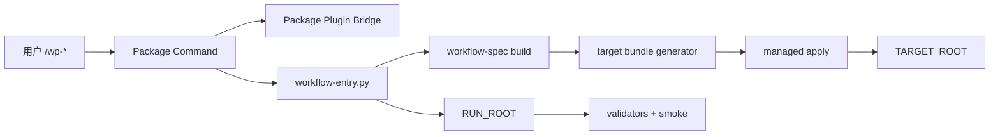
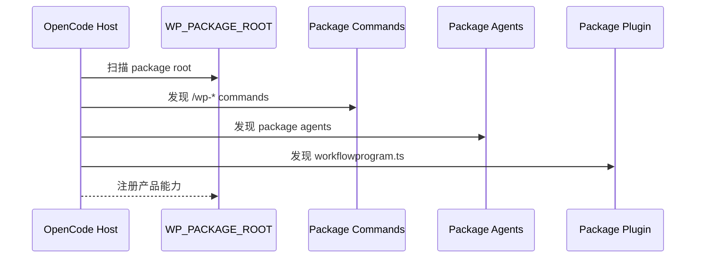
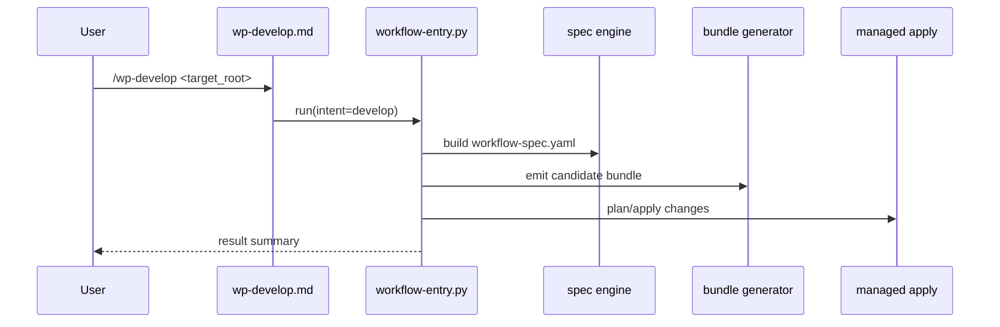
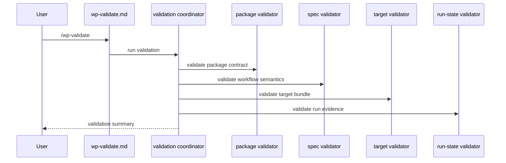
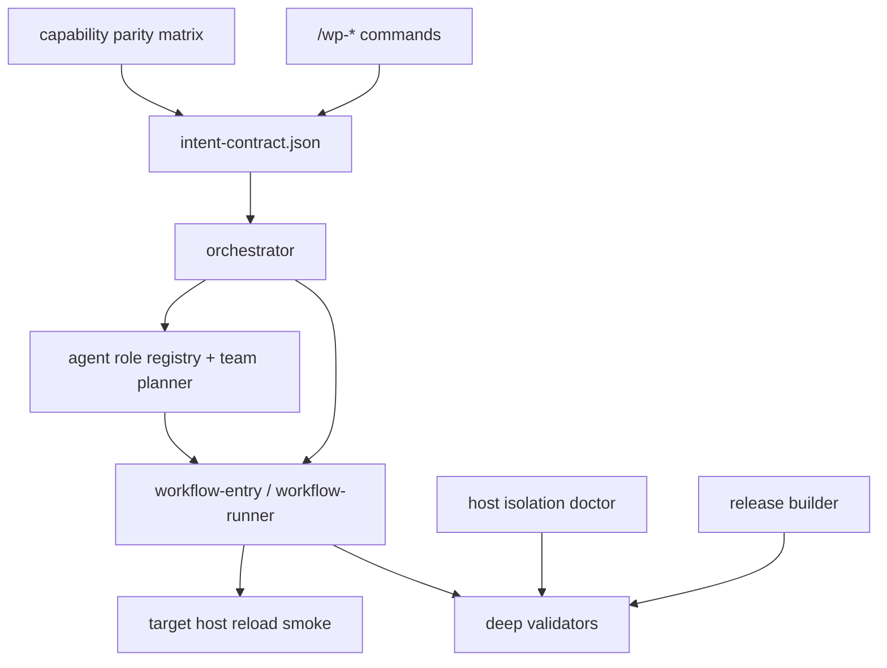
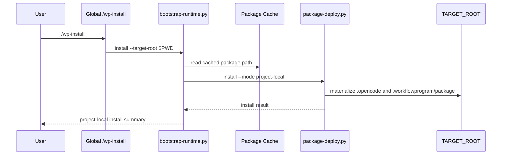

# OpenCode V2 特性设计说明书（LowLevel设计）

## 目的与范围

本文档给出 WorkflowProgram OpenCode v2 的实现级设计，面向实现者回答以下问题：

- WorkflowProgram 产品包如何组织命令、插件与运行时
- `/wp-*` 产品命令如何进入 runtime 主链
- `workflow-spec.yaml` 如何作为目标工作流语义真源
- 目标 bundle 如何生成、校验并受控写入
- package/spec/target/run-state 四层校验如何分工

本文档遵循 [opencode-v2-highlevel-design.md](./opencode-v2-highlevel-design.md)。

## 特性相关需求列表

| 编号 | 需求名称 | 特性描述 |
|---|---|---|
| FR-01 | Package Auto Load | OpenCode 自动加载 WorkflowProgram 产品包 |
| FR-02 | Command Namespace | 产品命令必须使用 `/wp-*` 命名空间 |
| FR-03 | Plugin Bridge | package plugin 提供 hook 与 custom tool 能力 |
| FR-04 | Runtime Entry | 产品命令统一进入 `workflow-entry.py` |
| FR-05 | Spec Build | runtime 生成目标工作流语义 spec |
| FR-06 | Target Bundle Emit | runtime 生成目标 `.opencode/*` 与 `.workflowprogram/*` |
| FR-07 | Managed Apply | 所有目标项目写入必须走 candidate + managed apply |
| FR-08 | Target Runtime Wrapper | 目标工作流必须交付自己的 runtime wrapper |
| FR-09 | Layered Validation | package/spec/target/run-state 分层校验 |
| FR-10 | Runtime Evidence | 每次运行产出最小证据集 |
| FR-11 | Package/Target Isolation | 产品包资产与目标工作流资产必须隔离 |
| FR-12 | Name Collision Avoidance | package command/plugin 与 target command/plugin 不得冲突 |
| FR-13 | Install & Deploy | 通过安装脚本把 `package/` 部署成 OpenCode 可发现布局 |
| FR-14 | Lifecycle Intent Closure | `audit`、`evolve`、`orchestrate` 与现有 intent 进入统一 command/runtime/spec contract |
| FR-15 | Agent Role Schema | package agents 具备机器可读的角色、阶段、能力、触发条件和优先级 |
| FR-16 | Agent Team Orchestration | runtime 能生成 team plan，并把 subagent 作为执行机制调用和汇聚 |
| FR-17 | Test Scenario Generation | 提供测试场景生成 agent 与 evidence 输出 |
| FR-18 | Host Isolation Diagnosis | doctor 能识别外部 OpenCode/Claude/oh-my-opencode 资产串入风险 |
| FR-19 | Host Compatibility Matrix | 记录 OpenCode 版本、plugin API、reload 要求和降级策略 |
| FR-20 | Target Host Reload Smoke | 验证生成后的 target command/plugin 被真实 OpenCode host 发现 |
| FR-21 | Release Package Build | 生成干净 release 包，排除运行态和本地依赖痕迹 |
| FR-22 | Schema Version & Migration | spec、manifest、run-state、install manifest 支持版本和迁移 |
| FR-23 | Managed Apply Hardening | 增加并发锁、幂等性、冲突解释、失败恢复与 rollback manifest |
| FR-24 | Unified Error Taxonomy | runtime、validator、doctor、plugin 使用统一错误码和 remediation |
| FR-25 | Permission & Privacy Policy | 明确写入权限、shell 执行、日志脱敏、证据保留策略 |
| FR-26 | Offline & Cross-Platform Install | 支持离线依赖、WSL/Windows 路径和重复安装/升级/卸载测试 |
| FR-27 | Deep Validation | 补充 draft、lowlevel、generated runtime、lessons delta、clarification review 校验 |
| FR-28 | Capability Parity Matrix | 维护 ClaudeCode 能力到 OpenCode 能力的可追踪映射 |
| FR-29 | Global Bootstrap Installer | 提供全局轻量部署器，支持新项目一键 project-local 安装 |
| FR-30 | User Package Cache | 提供用户级版本化 package cache，作为 bootstrap 安装源 |
| FR-31 | Bootstrap Lifecycle Commands | 全局只暴露 install/status/upgrade/uninstall，不暴露完整产品生命周期命令 |

## 特性分析
### 使用场景分析

| 场景 | 触发条件与对象 | 子场景 | 关键任务操作 |
|---|---|---|---|
| UC-01 产品包加载 | 用户启动 OpenCode；对象为 `WP_PACKAGE_ROOT` | 首次加载、重复加载 | 发现 package command、发现 package plugin、校验包完整性 |
| UC-02 设计目标工作流 | 用户执行 `/wp-develop` | 新建设计、已有设计覆盖更新 | 解析 target root、生成 spec、生成 bundle、managed apply、验证 |
| UC-03 校验目标工作流 | 用户执行 `/wp-validate` | 静态校验、运行校验 | 校验 spec、校验 target bundle、校验 run-state |
| UC-04 受控写入冲突 | 目标项目已有同路径文件 | 可自动更新、需要人工处理 | candidate 生成、冲突检测、输出 plan/result |
| UC-05 插件能力接入 | package plugin 已被宿主加载 | hook、custom tool | 仅提供 runtime 所必需能力，不替代 runtime 主链 |
| UC-06 目标工作流被宿主加载 | 目标 bundle 已交付到 `TARGET_ROOT` | commands only、commands + plugin | 宿主扫描 target OpenCode 资产并注册 |
| UC-07 产品包安装部署 | 用户执行安装脚本 | project-local、global、状态检查、卸载 | 复制产品命令/插件/runtime、合并配置、写 install manifest |
| UC-08 产品生命周期编排 | 用户不确定该执行哪个 `/wp-*` | audit、evolve、orchestrate | 识别 intent、路由命令、保持 command/runtime/spec flow 一致 |
| UC-09 agentteam 编排 | 设计、校验、审计需要多角色协作 | 顺序评审、fan-out/fan-in、quorum | 生成 team plan、调用 subagent、汇聚结论 |
| UC-10 宿主隔离诊断 | OpenCode 识别了非本项目资产 | global config、Claude 目录、oh-my-opencode | 扫描资产来源、输出污染风险和隔离建议 |
| UC-11 target host reload 验证 | 目标 workflow 已生成 | target command、target plugin | 真实启动或调用 OpenCode host 验证目标资产可见 |
| UC-12 发布构建 | 准备上传 GitHub/release | source package、dist package | 清洗构建、生成 manifest、校验完整性 |
| UC-13 契约升级 | spec/manifest 版本变化 | 自动迁移、拒绝迁移 | 读取版本、执行迁移、记录迁移报告 |
| UC-14 写入恢复 | apply 中断或冲突 | 并发、只读、用户改动 | 加锁、生成冲突说明、回滚或恢复 |
| UC-15 离线与跨平台安装 | 无网络或 WSL/Windows 混用 | dependency lock、路径转换 | 使用锁定依赖、规范化路径、提示 reload |
| UC-16 新项目全局引导安装 | 用户在新项目打开 OpenCode | install、status、upgrade、uninstall | 全局 bootstrap 从用户 cache 安装完整 project-local package |

### 影响分析
#### 依赖与技术限制

- 依赖 OpenCode 已安装。
- 依赖 `python3` 可运行 runtime / validator 脚本。
- runtime 当前依赖 `PyYAML`，并通过 `requirements.txt` 显式声明。
- 安装器可选创建 `.workflowprogram/package/.venv`，并把后续命令执行绑定到该解释器。
- WorkflowProgram 产品命令只允许来自 `.opencode/commands/*.md`。
- WorkflowProgram package plugin 必须可被 `.opencode/plugins/` 自动加载。
- `workflow-spec.yaml` 只描述目标工作流语义，不承载产品包契约。
- target bundle 不能反向污染 `WP_PACKAGE_ROOT`。
- package plugin 与 target plugin 不得复用同名逻辑标识。
- package 运行时与分层 validator 必须随 `WP_PACKAGE_ROOT` 一起交付，不能依赖仓库根路径中的额外脚本。
- v1 不依赖 `dist/opencode/`，但需要安装脚本把 `package/` 物化成宿主可发现布局。
- 为改善新项目使用体验，允许安装全局 bootstrap；但 bootstrap 不等同于完整 WorkflowProgram 全局安装。
- 全局 bootstrap 默认写入 OpenCode global `commands/` 和 `.workflowprogram/bootstrap/`，完整 package 写入用户级 cache。

#### 硬件限制

- 无特殊硬件要求。
- 需要稳定本地磁盘与可执行子进程环境。
- 大型项目场景下，candidate bundle 和 `RUN_ROOT` 会带来额外 I/O 成本。

### 公开/业界方案分析

对当前场景，最合适的是“命令入口 + 本地插件 + 文件契约 + 受控写入”的组合，而不是把所有控制面逻辑塞进插件或大提示词。

| 方案 | 优点 | 缺点 | 结论 |
|---|---|---|---|
| 纯 plugin 驱动 | 宿主耦合强、交互自然 | 容易把运行控制面塞进插件，难验证 | 不采用 |
| 纯 prompt/skill 驱动 | 灵活 | 不确定、难追踪、边界弱 | 不采用 |
| command + runtime 脚本 | 控制清晰、易审计 | 需要维护脚本链 | 采用 |
| command + plugin bridge + runtime | 兼顾 hook/tool 与控制面 | 需要明确边界 | v1 采用 |
| full global install | 新项目零部署 | 命令污染、版本串扰、隔离弱 | 不采用 |
| global bootstrap + project-local materialization | 新项目只需运行 `/wp-install`，同时保持隔离 | 需要维护 cache 和 bootstrap 版本 | 采用 |

## 特性/功能实现原理
### 总体方案



### 特性功能设计

建议拆成 8 个特性模块：

| 模块 | 作用 | 所属契约层 |
|---|---|---|
| F1 Package Load | 加载 WorkflowProgram 产品包 | 产品包契约 |
| F2 Package Entry | `/wp-*` 命令分发 | 产品包契约 |
| F3 Plugin Bridge | 提供 hook/custom tool | 产品包契约 |
| F4 Workflow Semantics Build | 生成目标工作流语义 spec | 工作流语义契约 |
| F5 Target Bundle Delivery | 生成并写入目标 bundle | 目标交付契约 |
| F6 Evidence & Validation | 运行证据与分层校验 | 运行证据契约 |
| F7 Global Bootstrap | 全局轻量部署入口 | 安装部署契约 |
| F8 User Package Cache | 版本化 package 安装源 | 安装部署契约 |

### UC-01 产品包加载实现
#### 设计思路

- `WP_PACKAGE_ROOT` 作为 WorkflowProgram 产品包根目录。
- OpenCode 启动后自动扫描 `.opencode/commands/*.md`、`.opencode/agents/*.md` 和 `.opencode/plugins/*.ts`。
- package validator 在本地或 CI 中检查产品包契约完整性。
- 加载结果不应依赖 `workflow-spec.yaml`。

#### 实体关系分析

| 实体 | 说明 |
|---|---|
| `PackageManifest` | package 根目录及关键文件集合 |
| `PackageCommand` | 产品命令定义 |
| `PackageAgent` | 产品 agent 定义 |
| `PackagePlugin` | 产品插件定义 |
| `PackageCompatibility` | package 对宿主能力的兼容描述 |

#### 时序分析



### UC-02 `/wp-develop` 实现
#### 设计思路

- 产品命令只负责入口参数归一化。
- 所有阶段编排统一进入 `workflow-entry.py`。
- `workflow-entry.py` 负责创建 `RUN_ROOT`、解析 `TARGET_ROOT`、调度 spec 构建和 bundle 生成。
- 目标项目写入统一走 candidate -> plan -> apply。

#### 实体关系分析

| 实体 | 说明 |
|---|---|
| `PackageCommandContext` | `/wp-develop` 的解析上下文 |
| `TargetContext` | `TARGET_ROOT` 相关上下文 |
| `RunContext` | `RUN_ROOT` 与本次执行参数 |
| `WorkflowSpecModel` | 目标工作流语义模型 |
| `CandidateBundle` | 待应用目标 bundle |
| `ManagedPlan` | candidate 与 target 的差异计划 |
| `ManagedResult` | apply 执行结果 |

#### 时序分析



### UC-03 `/wp-validate` 实现
#### 设计思路

- `/wp-validate` 是产品命令，不是 target command。
- 它校验的是：
  - WorkflowProgram 产品链是否能正确读取并理解目标工作流
  - `TARGET_ROOT` 现有资产是否满足目标交付契约
  - `RUN_ROOT` 证据是否闭合
- 它调用的 validator 必须来自当前 package runtime 对应的 `validators/` 目录；部署后路径为 `WP_PACKAGE_ROOT/.workflowprogram/package/runtime/validators/`。

#### 实体关系分析

| 实体 | 说明 |
|---|---|
| `ValidationRequest` | 校验请求 |
| `PackageValidationSummary` | 产品包校验结果 |
| `SpecValidationSummary` | 语义 spec 校验结果 |
| `TargetValidationSummary` | 目标 bundle 校验结果 |
| `RunStateValidationSummary` | 运行态证据校验结果 |

#### 时序分析



### UC-04 受控写入冲突实现
#### 设计思路

- 目标工作流生成结果先落到 candidate 目录。
- `managed-assets.py` 比较 candidate 与 target 状态。
- 冲突产出 `managed-change-plan.json` 和 `managed-change-result.json`。
- 未经明确规则允许，不能静默覆盖目标文件。

#### 实体关系分析

| 实体 | 说明 |
|---|---|
| `CandidateAsset` | 候选文件 |
| `ManagedDiff` | 差异条目 |
| `ManagedPlan` | 变更计划 |
| `ManagedManifest` | 已管理文件清单 |
| `ConflictRecord` | 冲突记录 |

### UC-05 Package Plugin Bridge 实现
#### 设计思路

- `workflowprogram.ts` 只承担 package plugin bridge 职责。
- 它可以做：
  - 注册最小 hook
  - 暴露 custom tool
  - 为 package commands 或 runtime 提供桥接能力
- 它不应做：
  - 替代 `workflow-entry.py`
  - 直接实现完整 stage runner
  - 同时承载 target workflow plugin 逻辑

#### 实体关系分析

| 实体 | 说明 |
|---|---|
| `PackagePluginBridge` | WorkflowProgram 产品插件桥接器 |
| `HookBinding` | hook 绑定定义 |
| `ToolBinding` | custom tool 绑定定义 |
| `PluginRuntimeContext` | 插件执行上下文 |

### UC-06 目标工作流被宿主加载
#### 设计思路

- 目标工作流被宿主加载，属于 target bundle contract。
- v1 当前由目标 `workflow-spec.yaml` 控制的 host-visible 交付物只有 target commands 与 target plugins。
- v1 默认至少交付：
  - target `.workflowprogram/design/*`
  - target `.workflowprogram/runtime/*`
- target `.opencode/commands/*`、`.opencode/plugins/*` 是否交付，取决于具体目标工作流模式。
- target agents / skills 仍保留为后续扩展，不属于当前实现范围。

### UC-07 产品包安装部署
#### 设计思路

- 仓库内 `package/` 作为部署源，不直接等同于宿主最终加载布局。
- 安装脚本支持：
  - `project-local`：把产品命令和插件部署到项目根 `.opencode/`，把 package runtime 部署到 `.workflowprogram/package/runtime/`
  - `global`：把产品命令和插件部署到全局 config root，把 package runtime 部署到 `.workflowprogram/package/runtime/`
- `project-local` 安装允许 package assets 与 target assets 共存，但依赖命名空间隔离与 runtime 路径隔离。
- 安装器只保守合并 `opencode.json` 中 package 所需的 `permission.bash` 和 `watcher.ignore`。
- 若启用 `--create-venv`，安装器使用指定 base Python 创建 `.workflowprogram/package/.venv`，再执行 `pip install -r requirements.txt`。
- 安装器必须写 install manifest，用于状态检查和卸载。

#### 实体关系分析

| 实体 | 说明 |
|---|---|
| `TargetBundleManifest` | 目标 bundle 清单 |
| `TargetCommand` | 目标项目命令 |
| `TargetRuntimeWrapper` | 目标项目 runtime wrapper |
| `TargetPlugin` | 目标项目插件，可选 |

### Story划分与依赖设计（use case分解为story）

| Story | 说明 | 依赖 |
|---|---|---|
| S1 | 建立 `WP_PACKAGE_ROOT` 目录结构 | 无 |
| S2 | 实现 `workflowprogram.ts` package plugin bridge 骨架 | S1 |
| S3 | 实现 `/wp-develop`、`/wp-validate` package commands | S1 |
| S4 | 实现 root 解析与 `RunContext` | S1 |
| S5 | 实现 workflow spec 生成链路 | S4 |
| S6 | 实现 target bundle generator | S5 |
| S7 | 实现 managed apply | S6 |
| S8 | 实现 package/spec/target/run-state validators | S4-S7 |
| S9 | 实现 smoke harness | S8 |
| S10 | 实现 target runtime wrapper 验证 | S6-S8 |

### 模块与接口设计

| 模块 | 关键接口 | 说明 |
|---|---|---|
| `package_contract` | `validate_package_root(root)` | 校验 WorkflowProgram 产品包 |
| `package_command_router` | `dispatch(intent, args)` | 标准化产品命令上下文 |
| `package_plugin_bridge` | `register_hooks()` / `register_tools()` | 注册最小 hook/tool |
| `runtime_context` | `build_context(package_root, target_root)` | 统一根路径与运行上下文 |
| `workflow_spec_engine` | `build_spec(context)` | 生成目标工作流语义 |
| `target_bundle_generator` | `emit_candidate(spec, target_root)` | 生成 target candidate bundle |
| `managed_apply_engine` | `plan_apply(candidate, target_root)` | 受控写入目标项目 |
| `validation_coordinator` | `run_validations(context)` | 组织四层校验 |
| `evidence_writer` | `write_state()` / `write_event()` / `write_report()` | 输出运行证据 |

### story设计
#### 类设计

推荐保持“轻 dataclass + service module”风格，不引入过重 OOP。

| 类/数据对象 | 作用 |
|---|---|
| `PackageContext` | 表示 `WP_PACKAGE_ROOT` 上下文 |
| `TargetContext` | 表示 `TARGET_ROOT` 上下文 |
| `RunContext` | 表示 `RUN_ROOT` 与运行参数 |
| `WorkflowSpecModel` | 表示目标工作流语义模型 |
| `CandidateBundle` | 表示待应用目标 bundle |
| `ManagedPlan` | 表示 apply 计划 |
| `ValidationSummary` | 表示分层校验结果 |

#### 实现设计

建议文件职责如下：

| 文件 | 职责 |
|---|---|
| `package/.opencode/commands/wp-develop.md` | 产品设计入口 |
| `package/.opencode/commands/wp-validate.md` | 产品校验入口 |
| `package/.opencode/plugins/workflowprogram.ts` | package plugin bridge |
| `package/.workflowprogram/runtime/workflow-entry.py` | 主入口编排 |
| `package/.workflowprogram/runtime/workflow-runner.py` | 阶段推进 |
| `package/.workflowprogram/runtime/managed-assets.py` | candidate/apply |
| `package/.workflowprogram/runtime/package-deploy.py` | 安装、状态检查与卸载 |
| `package/.workflowprogram/runtime/requirements.txt` | runtime Python 依赖声明 |
| `package/.workflowprogram/runtime/validators/package_contract_validator.py` | 产品包校验 |
| `package/.workflowprogram/runtime/validators/workflow_spec_validator.py` | 语义 spec 校验 |
| `package/.workflowprogram/runtime/validators/target_bundle_validator.py` | 目标 bundle 校验 |
| `package/.workflowprogram/runtime/validators/run_state_validator.py` | 运行态证据校验 |

#### 关键实现约束

| 约束 | 说明 |
|---|---|
| C-01 | `/wp-*` 只属于产品包命令，不属于 target workflow |
| C-02 | `workflowprogram.ts` 只属于产品包插件，不属于 target plugin |
| C-03 | `workflow-spec.yaml` 只描述目标工作流，不描述 package contract |
| C-04 | `TARGET_ROOT` 写入必须先 candidate 再 apply |
| C-05 | validator 必须分层，不得跨层兜底 |
| C-06 | 目标命令和目标插件不得占用 `wp-*` 与 `workflowprogram.ts` 产品标识 |
| C-07 | 可部署的 `WP_PACKAGE_ROOT` 必须自包含 runtime 与 validator，不得运行时回跳仓库根目录取脚本 |
| C-08 | 部署后的 package runtime 必须位于 `.workflowprogram/package/runtime/`，不得与 target `.workflowprogram/runtime/` 复用同一路径 |
| C-09 | command 文件、`SUPPORTED_PACKAGE_INTENTS`、runtime handler、spec `intent_flows` 必须保持一一可追踪 |
| C-10 | agentteam 只描述团队结构和阶段职责，不直接等同于 OpenCode subagent 执行机制 |
| C-11 | host isolation 只能诊断和建议隔离，不能默认删除用户全局 OpenCode 或 Claude 资产 |
| C-12 | target host reload smoke 必须与 package host smoke 分开计分 |
| C-13 | release build 产物不得包含 `.workflowprogram/runs`、`__pycache__`、`node_modules`、本地 lock 或 provider token |
| C-14 | schema migration 必须保留原始版本与迁移报告，不得静默改写用户无法追踪的状态 |
| C-15 | managed apply 必须先加锁再写入，失败时产出可恢复状态 |
| C-16 | 所有错误必须映射到统一 error code，不能只输出自由文本 |
| C-17 | 日志和证据默认不得泄露 API key、token、完整敏感环境变量 |
| C-18 | 离线安装路径不得强依赖实时网络；网络依赖只能作为可选加速路径 |

## 差距闭环实现设计

本节把 HighLevel 中的 `GC-*` 改动目标落到实现级方案。实施原则是先保证契约一致，再扩展体验；先补可验证缺口，再补产品化增强。

### 总体实现方案



### 改动目标到实现模块映射

| 改动目标 | 新增/修改模块 | 关键输出 |
|---|---|---|
| GC-01 生命周期入口完整 | `runtime_common.py`、`workflow-entry.py`、`workflow-runner.py`、`route-intent.py`、`package/.opencode/commands/wp-audit.md`、`wp-evolve.md`、`wp-orchestrate.md` | intent contract、run summary、audit/evolve report |
| GC-02 agentteam 编排 | `agent-role-registry.json`、`agent-team-planner.py`、agent frontmatter | team plan、dispatch trace、fan-in report |
| GC-03 测试场景生成 | `package/.opencode/agents/test-scenario-generator.md`、`test-scenario-generator` runtime adapter | test scenarios artifact |
| GC-04 宿主隔离与兼容诊断 | `doctor.py`、`discover-host-capabilities.py`、`probe-host-capabilities.py` | host isolation report、compatibility verdict |
| GC-05 target host reload smoke | `host-integration-smoke.py` 或新增 `target-host-smoke.py` | target command/plugin discovery report |
| GC-06 release build | `tools/build_package.py`、`dist/opencode/manifest.json` | clean package、checksum、release manifest |
| GC-07 schema migration | `schema_versions.py`、`migrations/` | migration plan/report |
| GC-08 managed apply hardening | `managed-assets.py`、`lockfile`、`rollback manifest` | conflict report、rollback/recover report |
| GC-09 错误码与权限 | `error_codes.py`、`permission_policy.yaml`、plugin/runtime adapters | typed failure code、remediation |
| GC-10 深度 validator | `validate-workflow-draft.py`、`validate-workflow-lowlevel.py`、`validate-generated-runtime.py`、`validate-lessons-delta.py`、`generate-clarification-review.py` | deep validation summary |
| GC-11 安装生命周期 | `package-deploy.py`、`requirements.lock.txt`、installer smoke | upgrade/uninstall/offline/path report |
| GC-12 能力映射矩阵 | `design/opencode-v2-capability-parity-matrix.md` | parity status and traceability |

### UC-08 产品生命周期编排实现

#### 设计思路

- 建立单一 `IntentContract`，记录每个 intent 的 command 文件、runtime id、是否变更目标项目、必须阶段、输出证据和允许失败类型。
- `/wp-orchestrate` 调用 `route-intent.py`，根据用户自然语言选择 intent；若置信度不足则输出澄清问题，不直接执行变更型 intent。
- `audit` 为非变更 intent，检查目标工作流设计、证据、host 加载和 lessons。
- `evolve` 为受控变更 intent，必须基于 audit 或 validate 的证据生成变更计划，再走 managed apply。

#### 实体关系分析

| 实体 | 说明 |
|---|---|
| `IntentContract` | command/runtime/spec flow 的真源映射 |
| `IntentRouteResult` | `/wp-orchestrate` 的路由结果 |
| `AuditReport` | 非变更审计报告 |
| `EvolvePlan` | 基于审计和 lessons 的演进计划 |

### UC-09 agentteam 编排实现

#### 设计思路

- agent 文件继续使用 OpenCode subagent 机制，但增加机器可读 frontmatter。
- `agentteam` 由 runtime 生成 `team-plan.json`，描述阶段、角色、并行度、输入、输出、汇聚策略。
- subagent 是执行手段；同一阶段可以无 agent、一个 agent、多个 agent 并行或多轮 fan-in。
- `workflow-designer` 负责设计，`workflow-validator` 负责契约校验，`workflow-verifier` 负责证据闭环，reviewer 负责专项审查，`test-scenario-generator` 负责场景覆盖。

#### 推荐 agent frontmatter

```yaml
role: workflow-validator
stage_affinity: [validate, audit, ship]
capabilities: [contract-check, evidence-review]
trigger: on-validation-required
priority: 50
fan_in: required
```

### UC-10 宿主隔离诊断实现

#### 设计思路

- doctor 增加 host source inventory：列出当前项目 `.opencode/*`、全局 OpenCode config、可能被宿主识别的 Claude/oh-my-opencode 资产。
- 输出只读诊断，不自动删除或移动用户资产。
- remediation 只提供明确步骤，例如设置项目级隔离目录、重启 OpenCode、清理误挂载路径。

#### 检查项

| 检查 | 失败分类 |
|---|---|
| 全局 OpenCode config 是否注入额外 commands/agents/skills | `host_pollution` |
| Claude `.claude/skills` 是否被当前 OpenCode 进程识别 | `cross_host_pollution` |
| oh-my-opencode 是否提供同名 agent/skill/command | `namespace_shadowing` |
| OpenCode 版本是否满足 plugin API 要求 | `host_incompatible` |
| plugin 更新后是否需要 reload/restart | `host_reload_required` |

### UC-11 target host reload smoke 实现

#### 设计思路

- 分成两类 smoke：
  - package host smoke：验证 WorkflowProgram 产品包可见。
  - target host reload smoke：验证目标 workflow 生成物可见。
- target host reload smoke 必须先运行 `/wp-develop` 生成带 target command/plugin 的 fixture，再通过真实 OpenCode host 检查目标资产。
- provider/API 不可用时只能返回 `ENVIRONMENT-SKIP`，不能伪造 PASS。

### UC-12 release build 实现

#### 设计思路

- 新增构建脚本从 `package/` 复制到 `dist/opencode/` 或 release archive。
- 构建前执行清洗规则，禁止包含运行态目录和本地依赖目录。
- 构建后执行 package validator、install smoke 和 checksum 校验。

#### Release Manifest 最小字段

| 字段 | 说明 |
|---|---|
| `package_version` | WorkflowProgram OpenCode 包版本 |
| `source_commit` | 构建来源 commit |
| `build_time` | 构建时间 |
| `included_files` | 发布文件清单 |
| `excluded_patterns` | 清洗规则 |
| `checksums` | 文件或 archive checksum |

### UC-13 契约升级实现

#### 设计思路

- `workflow-spec.yaml`、`managed-files.json`、`state.json`、`install-manifest.json` 都必须有 `schema_version`。
- validator 先判断版本，再决定直接校验、自动迁移或拒绝。
- migration 输出 `migration-report.json`，记录 from/to、变更项、备份位置和风险。

### UC-14 写入恢复实现

#### 设计思路

- managed apply 开始前创建 lock，lock 中记录 pid、run id、target root、开始时间。
- diff 使用内容 hash，重复执行相同 candidate 不产生无意义改动。
- 写入前生成 rollback manifest；中断后 `/wp-doctor` 能识别并提示 recover/rollback。

### UC-15 离线与跨平台安装实现

#### 设计思路

- `requirements.lock.txt` 作为离线和可复现安装依据。
- 安装脚本必须明确当前 Python、pip、venv、路径风格和 OpenCode 命令来源。
- WSL/Windows 混用时，manifest 同时记录原始路径和规范化路径；命令模板只使用当前宿主可执行路径。

### UC-16 新项目全局引导安装实现

#### 设计思路

- `package-deploy.py install-bootstrap` 只向 OpenCode global config 写入 bootstrap command 和 bootstrap runtime。
- 完整 package 被复制到用户级 cache，默认路径为 `~/.cache/workflowprogram-opencode/packages/<version>/package`。
- 用户在新项目运行 `/wp-install` 时，全局 command 调用 `bootstrap-runtime.py install --target-root "$PWD"`。
- `bootstrap-runtime.py` 从 bootstrap manifest 定位 cache package，再复用 `package-deploy.py install --mode project-local` 完成项目安装。
- `/wp-status`、`/wp-upgrade`、`/wp-uninstall` 只操作当前项目的 project-local install manifest。

#### 实体关系分析

| 实体 | 说明 |
|---|---|
| `BootstrapManifest` | 全局 bootstrap 安装状态、cache 根、cache package 根和命令清单 |
| `BootstrapCommand` | 全局轻量命令，只负责调用 bootstrap runtime |
| `PackageCacheEntry` | 版本化完整 package copy |
| `ProjectInstallManifest` | 项目本地安装真源，仍由 `package-deploy.py` 写入 |

#### 时序分析



### 扩展 Story 划分

| Story | 说明 | 依赖 |
|---|---|---|
| S11 | 定义 `IntentContract` 并修正 `audit` flow 不一致 | S3-S5 |
| S12 | 新增 `/wp-audit`、`/wp-evolve`、`/wp-orchestrate` | S11 |
| S13 | 实现 audit/evolve/orchestrate runtime handler | S12 |
| S14 | 新增 agent role schema 与 role registry | S2 |
| S15 | 新增 `test-scenario-generator` agent | S14 |
| S16 | 实现 agent team planner 和 team-plan evidence | S14-S15 |
| S17 | 扩展 doctor 的 host isolation 检查 | S9 |
| S18 | 增加 OpenCode compatibility matrix 与 reload guidance | S17 |
| S19 | 实现 target host reload smoke fixture | S6-S9 |
| S20 | 实现 target command/plugin 真实发现校验 | S19 |
| S21 | 新增 release build 脚本与清洗规则 | S1-S9 |
| S22 | 增加 release manifest 与 checksum 校验 | S21 |
| S23 | 为 spec/manifest/run-state/install manifest 增加 schema version | S5-S8 |
| S24 | 新增 migration engine 与迁移报告 | S23 |
| S25 | 为 managed apply 增加 lock、rollback、idempotent diff | S7 |
| S26 | 建立统一 error code registry | S8-S9 |
| S27 | 增加 permission/privacy policy 与日志脱敏 | S26 |
| S28 | 补充 deep validators 与 clarification review | S8 |
| S29 | 补充 golden fixtures 与 CI 回归入口 | S19-S28 |
| S30 | 建立 capability parity matrix 并接入 docs | S11-S29 |
| S31 | 实现 global bootstrap installer、cache、bootstrap runtime 与 smoke 覆盖 | S21-S30 |
