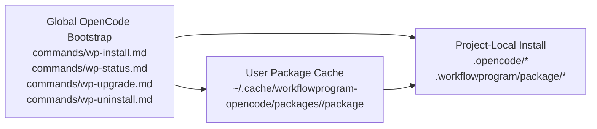

# Design: Lightweight Global Bootstrap Installer

## Architecture

The design uses a three-layer deployment model:



## Responsibilities

| Layer | Responsibility | Must Not Do |
|---|---|---|
| Global bootstrap | expose project deployment commands and locate cached package | load full `/wp-develop` product lifecycle globally |
| User package cache | store a clean versioned package copy | become a mutable project runtime |
| Project-local install | provide full WorkflowProgram commands, agents, plugin, runtime, venv, and manifest | depend on global mutable state at runtime |

## Data Contracts

### Bootstrap Manifest

Location:

```text
<global-opencode-root>/.workflowprogram/bootstrap/bootstrap-manifest.json
```

Required fields:

- `schema_version`
- `mode = global-bootstrap`
- `global_root`
- `cache_root`
- `cache_package_root`
- `bootstrap_version`
- `installed_files`
- `bootstrap_commands`

### Cache Layout

Default root:

```text
~/.cache/workflowprogram-opencode/packages/<version>/package
```

Environment override:

```text
WORKFLOWPROGRAM_OPENCODE_CACHE
```

The cache copy excludes runtime traces and local dependency folders:

- `.workflowprogram/runs`
- `__pycache__`
- `.pytest_cache`
- `.opencode/node_modules`
- package lock files
- `*.pyc`
- logs

## Command Model

Global bootstrap commands are intentionally limited:

| Command | Behavior |
|---|---|
| `/wp-install` | install the cached package into the current project using project-local mode |
| `/wp-status` | inspect the current project's project-local install |
| `/wp-upgrade` | reinstall the current project from the cached package |
| `/wp-uninstall` | remove the current project's project-local install |

Full product commands remain project-local:

- `/wp-develop`
- `/wp-validate`
- `/wp-preflight`
- `/wp-hotfix`
- `/wp-iterate`
- `/wp-audit`
- `/wp-evolve`
- `/wp-orchestrate`
- `/wp-ship`
- `/wp-doctor`

## Failure Modes

| Failure | Handling |
|---|---|
| Bootstrap manifest missing | fail with explicit global root path |
| Cache package missing | fail without mutating project |
| Python unavailable | command reports interpreter failure |
| PyYAML unavailable in system Python | bootstrap can pre-provision project venv before invoking package deploy |
| Project has unmanaged reserved paths | package deploy fails unless user explicitly forces |
| OpenCode command list not refreshed | user is told to restart OpenCode or reopen the project |

## Security And Isolation

- Global bootstrap has write authority only when the user explicitly runs a bootstrap command.
- The full product plugin is not installed globally by bootstrap.
- Project-local manifests remain the source of truth for installed project files.
- Cache contents are built from a filtered package copy and do not include local run evidence.
